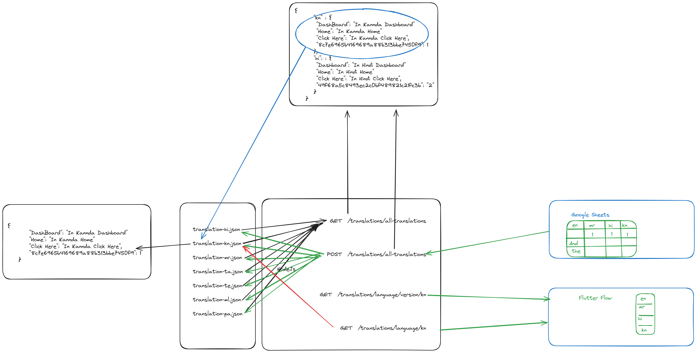

# Translation API

## Translations
### GET
Get all the translations. Behind the scenes this consolidate all the individual translation language files.

#### Request 
``` javascript
    GET  /translations/all-translations
```


#### Response
```javascript
    HTTP/1.1 200
    Content-Type: application/json

    {
       "kn" : {
        "DashBoard": "In Kannda Dashboard"
        "Home": "In Kannda Home"
        "Click Here": "In Kannda Click Here",
        "8c7e6965b4169689a88b313bbe7450f9": 1
       },
       "hi": : {
        "Dashboard": "In Hindi Dashboard"
        "Home": "In Hindi Home"
        "Click Here": "In Hindi Click Here",
        "49f68a5c8493ec2c0bf489821c21fc3b": "2"
       }
    }    
```
### POST
This request will receive the translations.
Behind the scenes this will receive all the translation and segreggate it to individual translation files in the server.

#### Request 
``` javascript
    POST  /translations/all-translations

    {
       "kn" : {
        "DashBoard": "In Kannda Dashboard"
        "Home": "In Kannda Home"
        "Click Here": "In Kannda Click Here",
        "8c7e6965b4169689a88b313bbe7450f9": 1
       },
       "hi": : {
        "Dashboard": "In Hindi Dashboard"
        "Home": "In Hindi Home"
        "Click Here": "In Hindi Click Here",
        "49f68a5c8493ec2c0bf489821c21fc3b": "2"
       }
    }  
```


#### Response
```javascript
    HTTP/1.1 200
    Content-Type: application/json
    {
       "message" : "Succeess"
    }   
```

## Version
### Get

#### Request 
``` javascript
    GET  /translations/language/version/:lang

    Example:
    GET  /translations/language/version/kn
```


#### Response
```javascript
    HTTP/1.1 200
    Content-Type: application/json
    {
        "version": 1
    }
    
```


## Language
### Get

#### Request 
``` javascript
    GET  /translations/language/:lang

    Example:
    GET  /translations/language/kn
```


#### Response
```javascript
    HTTP/1.1 200
    Content-Type: application/json

    {
        "DashBoard": "In Kannda Dashboard"
        "Home": "In Kannda Home"
        "Click Here": "In Kannda Click Here",
        "8c7e6965b4169689a88b313bbe7450f9": 1
    }
```
# adfs-translation-node
